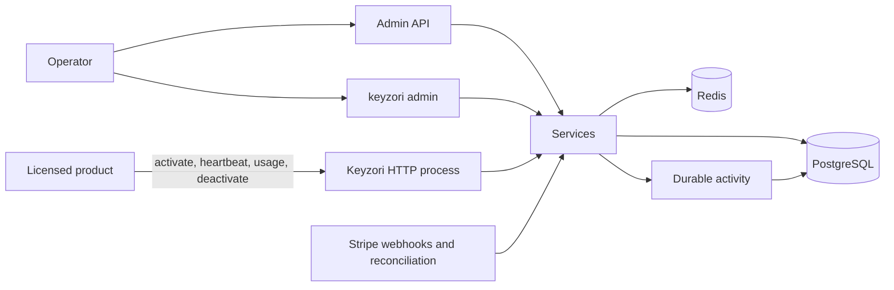

# Architecture

Keyzori ships one image containing one compiled `keyzori` executable with three entrypoints:

- `keyzori serve` starts the API, migration startup, activity retention, and optional Stripe synchronization;
- `keyzori admin ...` runs operator commands directly against PostgreSQL;
- `keyzori healthcheck` checks the running server's readiness endpoint.

## Layer boundaries

- Domain entities and repository contracts define customers, licenses, meters, registrations, activity, and Stripe synchronization without importing web or database frameworks.
- Application services enforce type behavior, status, registration, metering, and operator management.
- Drizzle repositories implement durable PostgreSQL storage and transactional operations.
- Redis implements bound sessions, concurrency limits, and rate limits.
- Elysia controllers validate the public runtime and authenticated admin contracts.

## Data and realtime statistics

PostgreSQL stores detailed activity for the configured retention period, lifetime counters, and minute buckets for high-volume heartbeat traffic. General activity API payloads never contain the full license secret, raw IP, or raw device ID. Exact access identifiers are exposed only in the authenticated per-license access view.

Meter consumption uses a database transaction and a unique `(licenseId, eventId)` constraint so retries cannot double-charge. Registration uses a per-license advisory transaction lock. Session admission and refresh use Redis scripts so concurrency and token binding remain atomic.

## Optional components

Stripe code is enabled only when both Stripe secrets are configured. Verified webhook events are durably queued, deduplicated by Stripe event ID, and processed asynchronously. Processing retrieves current subscription state before updating access, which makes duplicate and out-of-order delivery safe.

## Container boundary

The multi-stage Docker build installs locked dependencies with a BuildKit cache and copies `keyzori`, migrations, and legal notices into a pinned non-root distroless runtime. Compose runs it read-only and drops Linux capabilities. The runtime image includes neither Bun nor `node_modules`.
